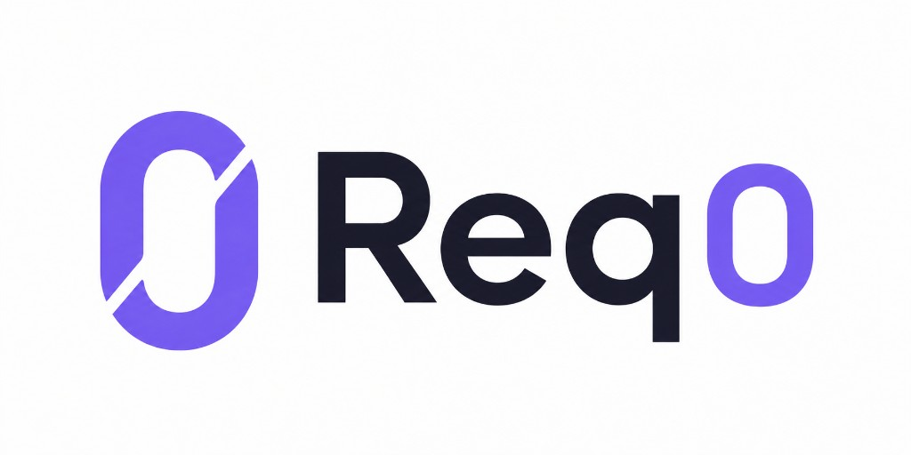

<div align="center">



</div>

# Req0

Req0 is a **requirement operating system** for a product git repo. One structured pack drives definition, implementation, and proof — not a ticket, a chat, or a separate test script.

A local **cockpit** runs that loop: a coding agent (Cursor or Copilot) interviews you, drafts frozen-grammar `requirement.md`, and later implements — only after you answer, a compiler checks the grammar, and **Jev** (TypeSafe System One) judges Ready. The browser then proves the app against the spec. If proof fails, **Fix from proof** sends that report back so the same agent can repair the implementation — not the spec.

Req0 is a CLI plus a thin HTML cockpit, free and open source. It is not a hosted SaaS.

## Install

Node.js **22.15** or newer.

```bash
npm install -g @richjava/req0
```

Or run without a global install:

```bash
npx @richjava/req0 start
```

You can open the cockpit and compile a spec with that alone. **Judgment, Implement, and Prove need Jev:** set `TYPESAFE_API_KEY` in the product repo’s `.env` (TypeSafe System One). Without the key, Check fails closed and Ready stays Not yet.

## Quick start

From the **product** repo (the app you are specifying), not from inside this package:

```bash
cd /path/to/your-product
req0 start
```

The cockpit opens at `http://127.0.0.1:4370` (or the next free port). From the requirement list, create a pack with a kebab-case id such as `001`. That writes `docs/requirements/<id>/`. On **Define**, describe the requirement and **Start** — the recorded coding agent interviews you (you can skip questions) and drafts frozen-grammar `requirement.md`. Optional PNG/JPG/WebP go in that pack’s `context/` folder. `req0 create` on the CLI still writes the starter template only.

You can also edit `requirement.md` yourself. Save compiles. Spec Valid means the [grammar](https://github.com/richjava/req0/blob/main/docs/grammar.md) parsed — it does not mean the spec is ready to implement. With a TypeSafe key, authoring keeps going until Ready is Clear; without one, it stops at Spec Valid.

## Commands

| Command | What it does |
| --- | --- |
| `req0 start` | Local cockpit |
| `req0 create <id>` | Create a pack folder (kebab-case) |
| `req0 compile` | Compile the pack; exit 2 on grammar errors |
| `req0 check` | Ask Jev to judge the spec. Needs `TYPESAFE_API_KEY`. Exit 3 if the key is missing; exit 2 if Ready is blocked |
| `req0 implement` | Launch the recorded coding agent after Ready. `--adapter=cursor\|copilot\|manual`. `--stack=nextjs-default\|amplify-gen2` on an empty repo |
| `req0 prove` | Run compiled browser QA after Ready (and Build, unless Implement is off) |

`req0 compile`, `check`, `implement`, and `prove` resolve a pack from the current directory (a pack folder, or the only pack under `docs/requirements/`). The cockpit does not auto-open a pack from the product root — you pick one from the list.

## Setup

### In the product repo

Packs live at `docs/requirements/<kebab-id>/`:

```text
docs/requirements/invoice-approval/
  requirement.md
  fixtures/personas.yaml    # test users, never production credentials
  fixtures/runtime.yaml     # app URL and login selectors for Prove
  context/                  # optional screenshots the authoring agent can Read
  derived/                  # generated; do not hand-edit
```

First run in an empty product repo asks how code should be written (**I’ll write the code**, **Cursor**, or **Copilot**) and, if an agent will implement, which stack. That writes `req0.json`. Set `"implement": false` when Req0 should not own Implement.

Copy names-only env vars into `.env` as needed. Do not put secrets in `.env.example`.

| Variable | Used for |
| --- | --- |
| `TYPESAFE_API_KEY` | Judgment **Check** (Jev / TypeSafe System One) |
| `AWS_REGION` / `AWS_PROFILE` | Amplify Gen 2 implement only. `ampx` does not read `.env` — export the vars or run `npx ampx configure profile` |

### Prove

```bash
npx playwright install chromium
```

`fixtures/runtime.yaml` must parse (`baseUrl`, login selectors). Personas supply test emails and passwords.

### Implement

Install the agent CLI you recorded: [Cursor](https://cursor.com) agent, or GitHub Copilot CLI. `--adapter=manual` skips launch.

## Grammar (short)

`requirement.md` needs one `#` title and these `##` sections: **Business Rules**, **Use Cases**, **Roles & Permissions**. Rules use `Id: BR-001` with Statement and Observable. Use cases use `Id: UC-001` with Actor, numbered Steps, and Outcome. The roles table cells are only `allow` or `deny`. Full rules: [docs/grammar.md](https://github.com/richjava/req0/blob/main/docs/grammar.md).

## Docs

- [What Req0 is](https://github.com/richjava/req0/blob/main/docs/product.md)
- [Cockpit](https://github.com/richjava/req0/blob/main/docs/cockpit.md)
- [Architecture and CLI](https://github.com/richjava/req0/blob/main/docs/architecture.md)
- [Glossary](https://github.com/richjava/req0/blob/main/docs/glossary.md)

## This git repository

Clone if you are changing Req0 itself:

```bash
git clone https://github.com/richjava/req0.git
cd req0
npm install
npm test
npm start
```

`npm start` is `req0 start` via `tsx`. `npm run build` compiles the CLI to `dist/` (what npm publishes).

This repo also contains a sample Invoice Desk app (Amplify Gen 2 + Next.js) and the golden `invoice-approval` pack. That app is **not** part of the published npm package. To run it from a clone: copy `.env.example` to `.env`, then `npm run sandbox`, `npm run db:seed`, and `npm run dev`. Personas: `docs/requirements/invoice-approval/fixtures/personas.yaml`.
